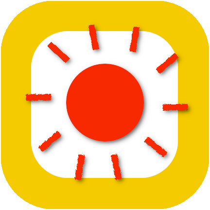

# Summer Flutter App

This is the most simple Flutter Material app in the world, built for educational purposes.


It loads an image in the center of the home screen and lets you set the app icon using the flutter_launcher_icons package. 


The illustraion is by Murat Kalkavan and downloaded from https://icons8.com/ouch/illustration/sign-up-5

Things to do to make it your own

* Replace /assets/icon/icon.png with your own 432x432 pixel icon. You have a template [icon.xcf](/assets/icon/icon.xcf) (GIMP file) under /assets/icon/.



* Build Android and iOS app icons. This uses the flutter_launcher_icons package. Run The following commands in the terminal: 

```bash
$ flutter pub get
$ flutter pub run flutter_launcher_icons:main
```

* Add your own image to /assets/images/

* replace the image reference in AssetImage() in main.dart

* Change backgroundColor in appBar and Scaffold to your favorite colors.

* Change the app titles in main.dart and pubspec.yaml. Save.

* build and run the app in debug mode with the following command:

```bash
$ flutter run
```

## License - This project is licensed under the GPL v3 license

Permissions of this strong copyleft license are conditioned on making available complete source code of licensed works and modifications, which include larger works using a licensed work, under the same license. Copyright and license notices must be preserved. Contributors provide an express grant of patent rights.

the full [LICENSE.md](LICENSE.md) is attached to this project